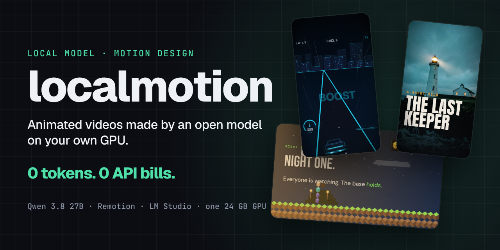
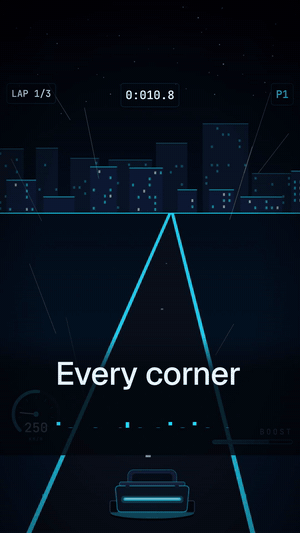
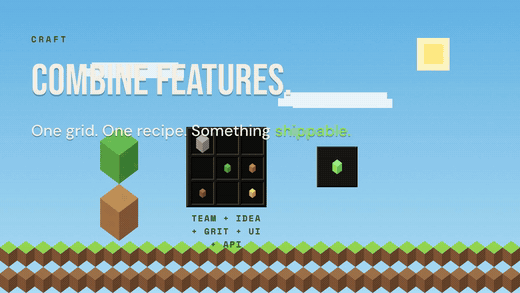
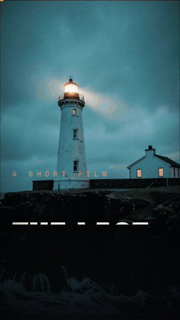
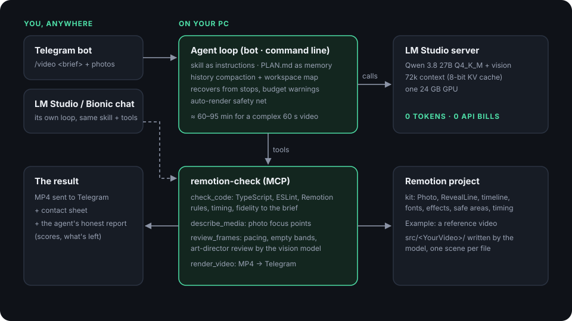

<p align="center"></p>

# localmotion

**Animated motion-design videos, written, checked and rendered by an open model running on your own GPU. 0 tokens, 0 API bills.**

You write a brief, or paste a script, and attach photos if you have them. A local model (Qwen 3.8 27B) plans the video, writes it as [Remotion](https://www.remotion.dev) code, checks its own work, looks at the rendered frames, fixes what's wrong and renders an MP4. Then it sends the video to your phone.

Nothing leaves your computer except the finished video. There are no tokens to buy, no subscriptions and no per-video cost: every video is free once you have the hardware.

<table>
<tr>
<td align="center" width="25%"><br><b>NEON DRIFT</b><br><sub>45 s racing-game trailer with HUD, split-screen duel, podium. 60 min, reviewer 6/10, my 7/10</sub></td>
<td align="center" width="50%"><br><b>Blockwise</b><br><sub>60 s pitch told as a voxel sandbox game: crafting, building, day/night, achievements. 95 min, 6/10</sub></td>
<td align="center" width="25%"><br><b>The Last Keeper</b><br><sub>The reference example shipped with the kit</sub></td>
</tr>
</table>

<sub>NEON DRIFT and Blockwise were made by Qwen 3.8 27B, unattended, from the briefs in <a href="examples/briefs">examples/briefs</a>, with no human edits to their code. Blockwise is the first attempt that completed after the agent-loop fixes; the failed earlier attempts are documented in <a href="docs/RESULTS.md">docs/RESULTS.md</a>. Every brand in them is invented.</sub>

## Why this works

A 27B model is clever enough to write good Remotion code. What it lacks is what a frontier coding agent has around it:

| What's missing | What localmotion adds |
|---|---|
| **Eyes.** It never sees a frame and reports "✅ done" on broken videos. | `review_frames` renders frames and has the vision model judge them like an art director. Pixel measurements catch frozen scenes and empty areas that vision models misjudge. |
| **Checks.** Errors surface only at render time, or never. | `check_code` runs TypeScript, ESLint and 20+ Remotion-specific rules: non-deterministic code, crashing animation ranges, slow or cut-off animations, fidelity to your brief. |
| **Taste.** Everything centered, system fonts, slides. | A **kit** of proven building blocks (photos with focus points, text reveals, timeline, type pairs, effects) and a **skill** with direction rules in numbers: sizes, safe areas, timing, layouts. |
| **Stamina.** Long jobs overflow the context and stop silently. | An **agent loop** with history compaction, a workspace map, a plan file as memory, recovery from silent stops and budget warnings, plus an auto-render safety net. |

<p align="center"></p>

## What you need

- **A 24 GB GPU** (tested on an RTX 3090) for Qwen 3.8 27B Q4 with vision. Smaller GPUs can run smaller models with the same tools, with lower quality.
- **[LM Studio](https://lmstudio.ai)** (or its Bionic edition), **Node.js 20+**, **[uv](https://docs.astral.sh/uv/)**, and ffmpeg (optional).
- Time: a complex 45-60 s video takes **60-95 minutes**, and a simple 30 s reel with photos ~15 minutes. Start it from your phone and do something else.

## Quickstart

```sh
git clone <this repo> localmotion && cd localmotion
./install.sh                 # check server, Remotion template, skill; prints the MCP config
./scripts/smoke_test.sh      # unit tests, code check, a real render, the vision model
```

1. In LM Studio, download **Qwen 3.8 27B Q4_K_M** together with its `mmproj` vision file, and set it up as in [docs/INSTALL.md](docs/INSTALL.md): 8-bit KV cache, 72k context.
2. Add the two MCP servers printed by `install.sh` to LM Studio.
3. Make your first video, in whichever way suits you:

| From | How |
|---|---|
| **Your phone** | `cd telegram_bot && ../remotion-check/.venv/bin/python setup_bot.py --install-service`, then send `/video <brief>` to your bot. You get a confirmation, every review score and the final video. |
| **The command line** | `agent/run_agent.py "$(cat examples/briefs/neon-drift-racing-trailer.txt)" --effort medium`, or drop a text file into `jobs/inbox/` while the bot runs. |
| **A chat** | Open a chat with the model in LM Studio / Bionic, with the MCP servers on, and ask for a video. Fine for short videos; for long ones prefer the bot, which has the full agent loop. |

## Results, honestly

From the acceptance runs described in [docs/RESULTS.md](docs/RESULTS.md):

- **It delivers.** Complex briefs (game-style trailers, voxel worlds, HUDs, split screens) end with a rendered video, unattended, and every outcome (success or failure) reaches your phone.
- **It follows your brief.** Your figures, names and lines end up on screen, checked automatically against your original prompt.
- **It's good, not great.** Unattended videos score around 6-7/10 by the reviewer rubric. Typical weak points are elements a bit small, repeated layouts and leftover empty space. The same model without these tools scored 2-3/10 and invented facts.
- **It's slow.** Most of the time goes into the model thinking, not into rendering.

Model comparison on the same 60 s brief: Qwen 3.8 27B delivered (7/10); Qwen 3.6 27B and a Qwen 3.8 fine-tune did not finish (with an earlier version of the agent loop); Gemma 4 12B looped and reported success on broken code. See [docs/RESULTS.md](docs/RESULTS.md).

## Testing

- `remotion-check/.venv/bin/python -m pytest tests` checks the rules, with no model or GPU needed.
- `./scripts/smoke_test.sh` checks the whole installation in about a minute.
- [docs/TESTING.md](docs/TESTING.md) describes the acceptance test: 5 complex briefs, unattended, measured against [DEFINITION-OF-DONE.md](DEFINITION-OF-DONE.md).

## Repository layout

```
remotion-check/      MCP server: check_code, describe_media, review_frames, render_video
skills/              the skill (instructions) for LM Studio / Bionic
agent/               the agent loop (also used by the bot and for testing)
telegram_bot/        setup wizard + bot: remote briefs, progress, delivery
remotion-template/   a ready Remotion project: kit + example
examples/briefs/     the briefs behind the showcased videos
tests/, scripts/     unit tests, smoke test
docs/                install, testing, results, assets
```

## Licenses and credits

- localmotion's own code: see [LICENSE](LICENSE).
- **[Remotion](https://www.remotion.dev/license)** has its own license: free for individuals and small teams, a company license above that. Check it before using localmotion commercially.
- Model weights keep their own licenses (Qwen: see its model card). Fonts come from Google Fonts (open licenses).
- The example photos in `remotion-template/public/example` were generated locally with FLUX.2 [klein].
